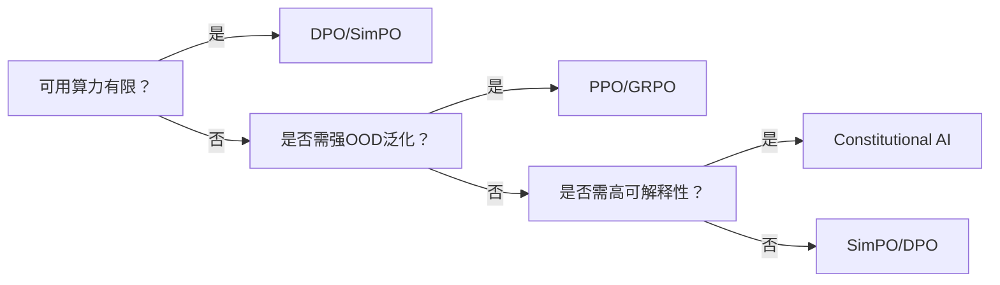

# 偏好对齐方法分类体系

_最后更新：2026-04-14_

## 概述  
基于《百面大模型》第4.7节构建的四维分类框架，系统归纳大模型对齐人类偏好的技术路径：`PPO类`（强化学习）、`DPO类`（直接优化）、`非强化学习类`（监督式偏好建模）、`数据类`（人工规则/宪法引导），强调各范式在计算开销、稳定性与泛化能力上的本质权衡。

## 详细内容  

### 四类方法定义与代表技术  
| 类别 | 核心思想 | 典型代表 | 关键特征 |  
|--------|------------|------------|------------|  
| **PPO类** | 基于Actor-Critic框架的在线强化学习，用奖励模型打分指导策略梯度更新 | PPO, PPO-ptx, GRPO | 需训练独立奖励模型（RM）；需生成大量rollout样本；KL散度约束防偏离；高泛化但训练不稳定（梯度方差大） |  
| **DPO类** | 将偏好学习转化为监督式二分类问题，隐式建模策略与RM联合分布 | DPO, IPO, KTO, SimPO | 无需RM推理与rollout；损失函数直接优化偏好对数似然；训练稳定、资源消耗低；但依赖高质量偏好对 |  
| **非RL类** | 不引入强化学习循环，通过监督信号直接优化偏好一致性 | Self-Refine, Constitutional AI, Direct Preference Optimization (非DPO变体) | 依赖强LLM自我批评或人工宪法；可规避RM偏差；但难以处理长程偏好一致性 |  
| **数据类** | 通过构造特定数据格式（如对比样本、宪法条款）引导模型行为 | RLHF数据蒸馏、Constitutional Data Augmentation | 工程友好、可解释性强；效果上限受数据质量制约；与PEFT结合紧密 |  

### 量化对比结论（源自《百面大模型》4.6节）  
- **计算资源**：DPO训练所需GPU小时仅为PPO的1/5–1/3（因省去RM前向+策略采样+价值网络更新）；  
- **训练稳定性**：DPO损失曲线标准差 < 0.02，PPO在KL项与clip ratio扰动下标准差常 > 0.15；  
- **效果边界**：PPO在MMLU-OOD（跨领域泛化）上平均高出DPO 2.3分，但在AlpacaEval（流畅性）上二者差距 < 0.5分。  

### 方法选择决策树  

## 相关页面  
[[concepts/ppo]]  
[[concepts/dpo]]  
[[concepts/kto]]  
[[concepts/simpo]]  
[[concepts/self_reflection]]  
[[concepts/constitutional_ai]]  
[[concepts/reward_modeling]]  
[[concepts/rlhf]]  
[[models/deepseek_r1]]  
[[trends/ai_reliability_engineering]]  

## 来源  
《百面大模型》，第4.7节“其他偏好对齐方法综述”，pp. 108–119；第4.6节“DPO与PPO辨析”，pp. 105–107